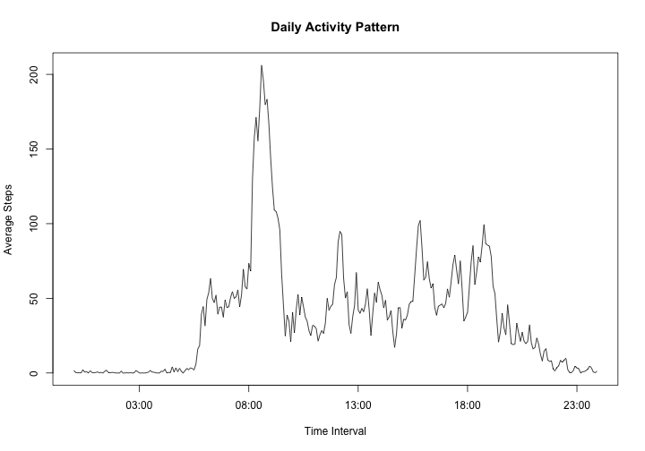

### Loading and preprocessing the data

1. First check if the raw data file (either activity.zip or activity.csv) exists. If not, download from the source URL, and/or unzip the file for loading.


```r
setwd("~/Dropbox/Programming/Coursera/repdata-013/PeerAssessment1")
if(!file.exists("activity.csv")) {      # Check if .csv file exists.
    if(!file.exists("activity.zip")) {  # Check if .zip file exists.
        fileURL <- "http://d396qusza40orc.cloudfront.net/repdata%2Fdata%2Factivity.zip"
        download.file(fileURL, destfile = "activity.zip", mode = "wb")
    }
    unzip("activity.zip")
}
```

2. Then load the data using _read.csv()_, and convert the "date" column from _Factor (class)_ to _Date(class)_.


```r
rawData <- read.csv("activity.csv", header = TRUE)
rawData$date <- as.Date(rawData$date)
head(rawData)
```

```
##   steps       date interval
## 1    NA 2012-10-01        0
## 2    NA 2012-10-01        5
## 3    NA 2012-10-01       10
## 4    NA 2012-10-01       15
## 5    NA 2012-10-01       20
## 6    NA 2012-10-01       25
```

### What is mean total number of steps taken per day?

1. Use the _plyr::ddply()_ function to analyze the total steps taken each day then plot the histogram of the resulting data frame. Missing values are removed using the _na.omit()_ function.


```r
library(plyr)
no_NA <- na.omit(rawData)
totalSteps <- ddply(no_NA, .(date), summarize, Total = sum(steps))
with(totalSteps, hist(Total, breaks = 20, col="red", axes = FALSE,
                      main = "Total Steps Taken Each Day",
                      xlab = "Number of Steps",
                      ylab = "Number of Days"))
axis(side = 1, at = seq(0, 22000, 1000))    # Specify x-axis tick locations.
axis(side = 2, at = seq(0, 10, 2))          # Specify y-axis tick locations.
```

 

```r
meanSteps <- mean(totalSteps$Total)
medianSteps <- median(totalSteps$Total)
options(digits = 10)
summary(totalSteps$Total)
```

```
##     Min.  1st Qu.   Median     Mean  3rd Qu.     Max. 
##    41.00  8841.00 10765.00 10766.19 13294.00 21194.00
```

```r
options(scipen = 1, digits = 4)
```

2. For total number of steps taken per day, the **mean** value _meanSteps_ is **10766.1887**, and the **median** value _medianSteps_ is **10765**. Notice that the median value differs from the summary table due to the rounding behavior in the _summary()_ function, as described in [this StackOverflow post](http://stackoverflow.com/a/26360801), which can be set using _digits_ in the _options()_ function.

## What is the average daily activity pattern?

1. To compute the average daily activity patern, i.e. the mean value of steps taken for any time interval throughout the days. Again, _plyr::ddply()_ function is used, and the "interval" column in the resulting data frame _averageSteps_ is expanded to _Date (class)_ just for plotting the X-axis label for readability. Missing values are removed.


```r
averageSteps <- ddply(rawData, .(interval), summarize,
                      Average = mean(steps, na.rm = TRUE))
averageSteps$Time <- with(averageSteps,
                          as.POSIXlt(formatC(interval, width = 4, flag = "0"),
                                     format = "%H%M"))
with(averageSteps, plot(Time, Average, type = "l",
                        main = "Daily Activity Pattern",
                        xlab = "Time Interval",
                        ylab = "Average Steps"))
```

 

```r
maxSteps <- max(averageSteps$Average)
maxInterval <- averageSteps$interval[which(averageSteps$Average %in% maxSteps)]
```

2. The maximum average number of steps in all the intervals _(maxSteps)_ is 206.1698, and it happens at interval 835 _(maxInterval)_.

### Imputing missing values

1. The total number of missing values is calculated by applying the _is.na()_ function to the "steps" column then sum all the _TRUE_ values.


```r
sum(is.na(rawData$steps))
```

```
## [1] 2304
```

2. Three strategies to fill the missing values will be evaluated and compared here:
* Use the averages steps of that day.
* Use the median value of that day.
* Use the mean value of that interval.


```r
newData1 <- rawData
newData2 <- rawData
newData3 <- rawData
for (i in 1:dim(rawData)[1]) {
    if (is.na(rawData$steps[i])) {
        index <- which(rawData$date %in% rawData$date[i])
        newData1$steps[i] <- mean(rawData$steps[index], na.rm = TRUE)
        newData2$steps[i] <- median(rawData$steps[index], na.rm = TRUE)
        newData3$steps[i] <- averageSteps[which(averageSteps$interval
                                                %in% rawData$interval[i]), 2]
    }
}
head(newData1)
```

```
##   steps       date interval
## 1   NaN 2012-10-01        0
## 2   NaN 2012-10-01        5
## 3   NaN 2012-10-01       10
## 4   NaN 2012-10-01       15
## 5   NaN 2012-10-01       20
## 6   NaN 2012-10-01       25
```

```r
head(newData2)
```

```
##   steps       date interval
## 1    NA 2012-10-01        0
## 2    NA 2012-10-01        5
## 3    NA 2012-10-01       10
## 4    NA 2012-10-01       15
## 5    NA 2012-10-01       20
## 6    NA 2012-10-01       25
```

```r
head(newData3)
```

```
##     steps       date interval
## 1 1.71698 2012-10-01        0
## 2 0.33962 2012-10-01        5
## 3 0.13208 2012-10-01       10
## 4 0.15094 2012-10-01       15
## 5 0.07547 2012-10-01       20
## 6 2.09434 2012-10-01       25
```

3. Because all missing values happen for the entire day (all 288 intervals), new NAs and/or NaNs will be inevitably introduced if the first two strategies were used. Therefore, the 3rd strategy will be adopted from here on.


4. The new histogram with the new dataset is plotted below:


```r
newTotalSteps <- ddply(newData3, .(date), summarize, Total = sum(steps))
with(newTotalSteps, hist(Total, breaks = 20, col="red", axes = FALSE,
                         main = "Total Steps Taken Each Day with NAs Filled",
                         xlab = "Number of Steps",
                         ylab = "Number of Days"))
axis(side = 1, at = seq(0, 22000, 1000))
axis(side = 2, at = seq(0, 18, 2))
```

 

```r
newMeanSteps <- mean(newTotalSteps$Total)
newMedianSteps <- median(newTotalSteps$Total)
options(digits = 10)
summary(newTotalSteps$Total)
```

```
##     Min.  1st Qu.   Median     Mean  3rd Qu.     Max. 
##    41.00  9819.00 10766.19 10766.19 12811.00 21194.00
```

```r
options(scipen = 1, digits = 4)
```

The new **mean** value _newMeanSteps_ is **10766.1887**, and the new **median** value _newMedianSteps_ is **10766.1887**. By adopting the 3rd strategy to fill the missing values, all the days ignored with missing data from the first part of this report are now in the 10000 to 11000 total daily steps range. This also offset the difference between the mean and the median values of the total daily steps reported previously.

### Are there differences in activity patterns between weekdays and weekends?

1. Use the _weekday()_ function to create a new factor variable with two levels, "weekday" and "weekend", to indicate wether a given date is a weekday or weekend day.


```r
whatDay <- rep("Weekday", dim(newData3)[1])
for (i in 1:length(whatDay)) {
    if (weekdays(newData3[i,2]) == "Saturday" | weekdays(newData3[i,2]) == "Sunday")
        whatDay[i] <- "Weekend"
    else whatDay[i] <- "Weekday"
}
whatDay <- as.factor(whatDay)
summary(whatDay)
```

```
## Weekday Weekend 
##   12960    4608
```

2. Plot the daily activity patterns as Weekdays vs. Weekends.

Here I chose to use the _base_ package for plotting for practice. _Lattice_ and _ggplot2_ will be practiced in the 2nd peer assessment assignment.


```r
weekday <- newData3[whatDay %in% "Weekday", ]
weekend <- newData3[whatDay %in% "Weekend", ]
averageWeekday <- ddply(weekday, .(interval), summarize,
                        Average = mean(steps, na.rm = TRUE))
averageWeekend <- ddply(weekend, .(interval), summarize,
                        Average = mean(steps, na.rm = TRUE))
default <- par() # Store default par() settings
par(mfrow = c(2, 1),
    mar = c(0, 0, 0, 0),
    oma = c(3.5, 2.5, 2, 1),
    xpd = NA)
with(averageWeekday, plot(interval, Average, type = "l", axes = FALSE,
                          col = "red", xlab = "", ylab = ""))
rect(-8, -7, 2400, 240)
axis(1, at = seq(0, 2400, 200), label = FALSE, pos = -7, tcl = -0.3)
axis(2, at = seq(0, 240, 40), pos = -8, cex = 0.8)
legend(c(0, 240), "Weekday", bty = "n", text.col = "red")
with(averageWeekend, plot(interval, Average, type = "l", axes = FALSE,
                          col = "blue", xlab = "", ylab = ""))
rect(-8, -7, 2400, 175)
axis(1, at = seq(0, 2400, 200), cex = 0.8)
axis(2, at = seq(0, 150, 30), pos = -8, cex = 0.8)
legend(c(0, 170), "Weekend", bty = "n", text.col = "blue")
mtext("Weekday vs. Weekend Daily Activity Pattern",
      side = 3, outer = TRUE, line = 0.8, font = 2)
mtext("Time Interval", side = 1, outer = TRUE,
      line = 2.5)
mtext("Number of Steps", side = 2, outer = TRUE,
      line = 1.5)
```

 

```r
suppressWarnings(par(default)) # Restore default par() settings w/o warnings.
```
